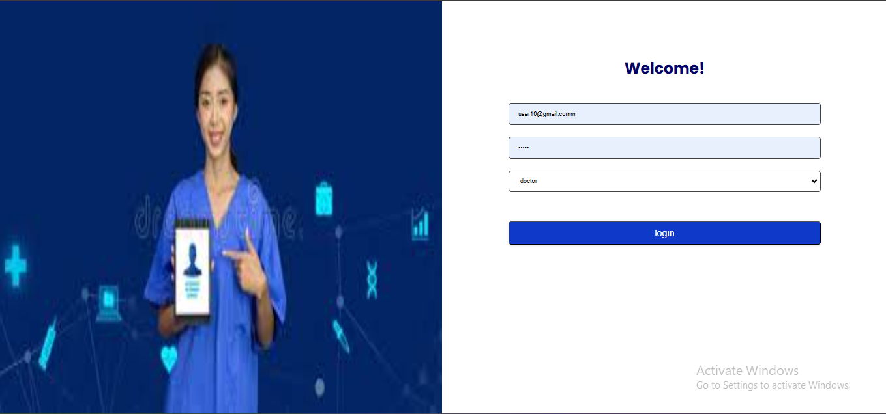
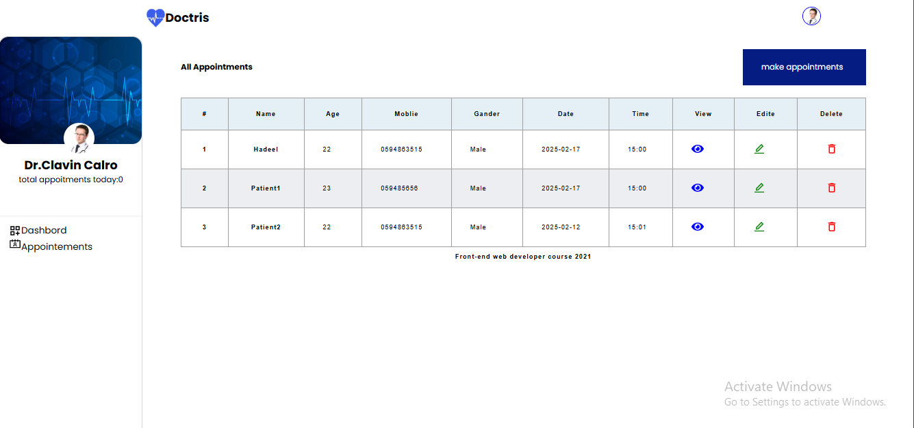
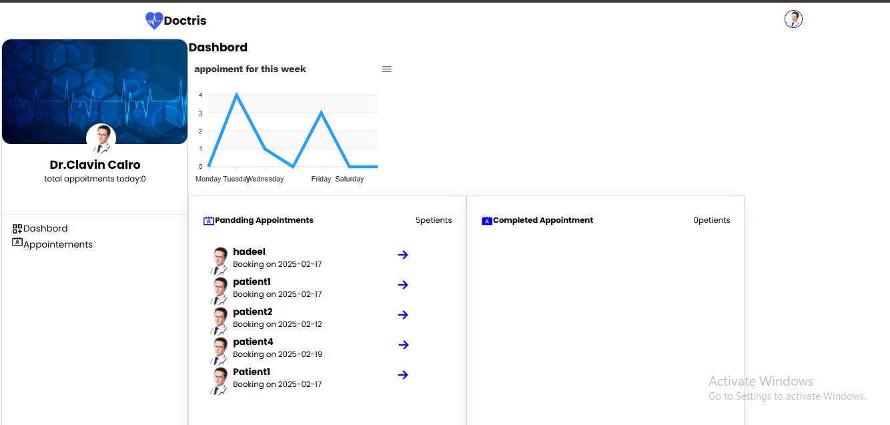
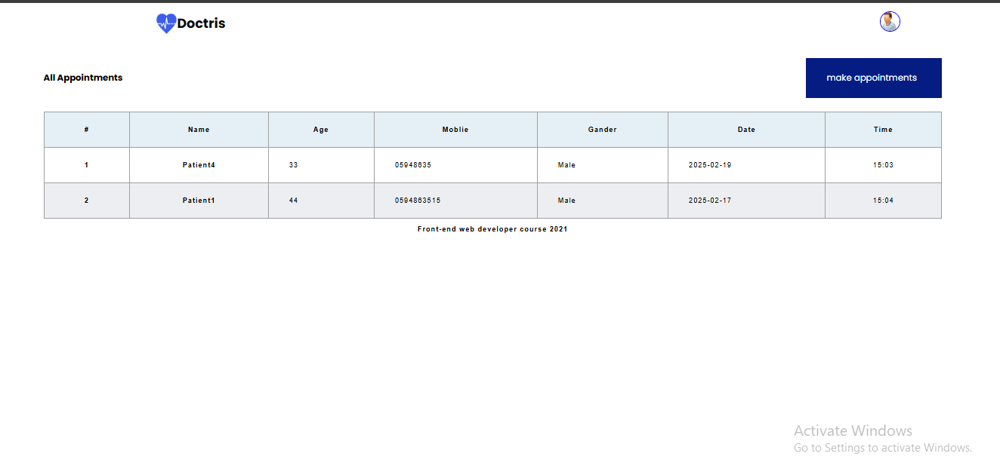
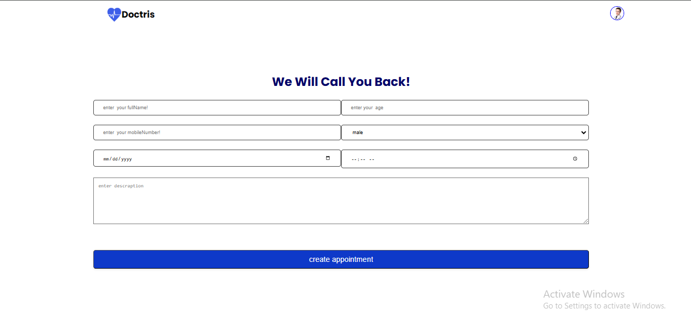

# Clinic Appointment System 🏥💻









A **React-based Clinic Appointment System** that allows patients and doctors to manage appointments efficiently.

## Features 🚀
- **Role-based Authentication** (Patients & Doctors) 🔑  
- **Patients:**
  - Book, view, and cancel appointments 📅
  - Check appointment history 📜
- **Doctors:**
  - Manage appointments and availability 🏥
  - View patient details and upcoming consultations 👨‍⚕️👩‍⚕️
- **Admin Dashboard** (Optional)

## Tech Stack 🛠️
- **Frontend:** React, React Router, Tailwind CSS
- **Backend:** Node.js, Express (if applicable)
- **Database:** MongoDB/MySQL (if applicable)

## Installation 📥
```sh
git clone https://github.com/HadeelAlwadia/TheGoodDoctor.git
cd clinic-appointment-system
npm install
npm start
